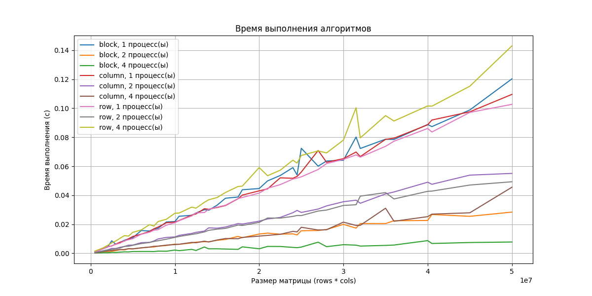
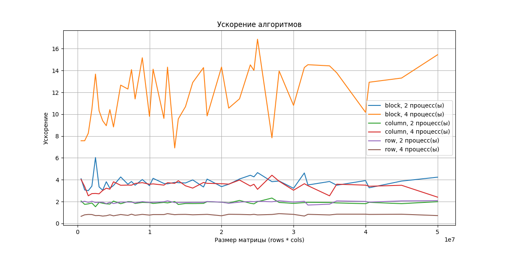
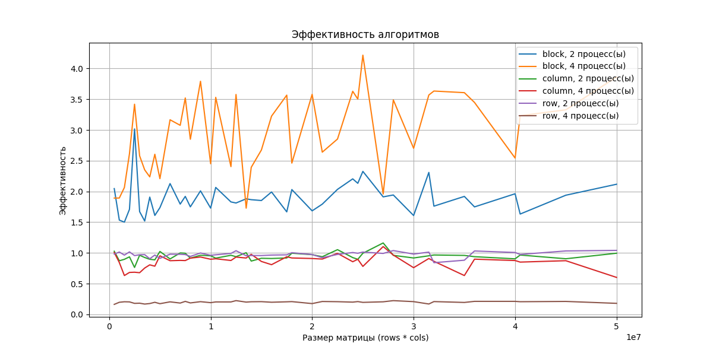
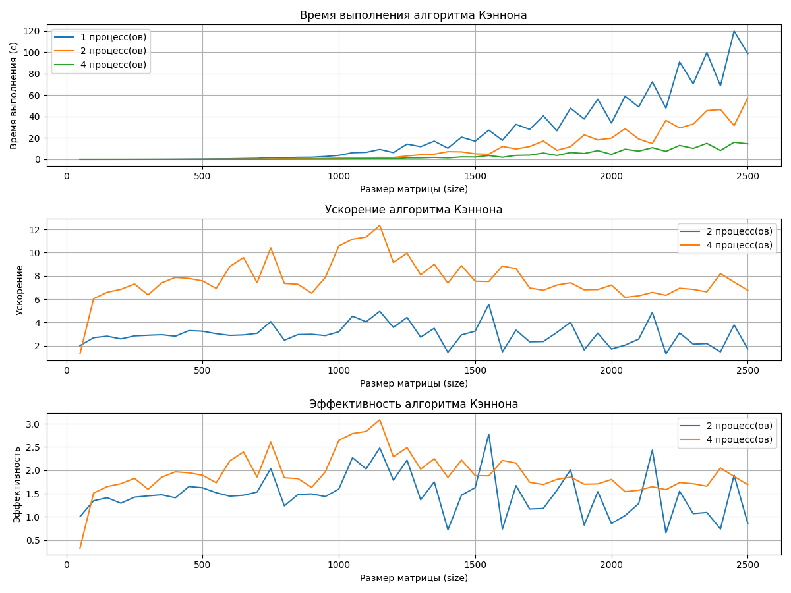
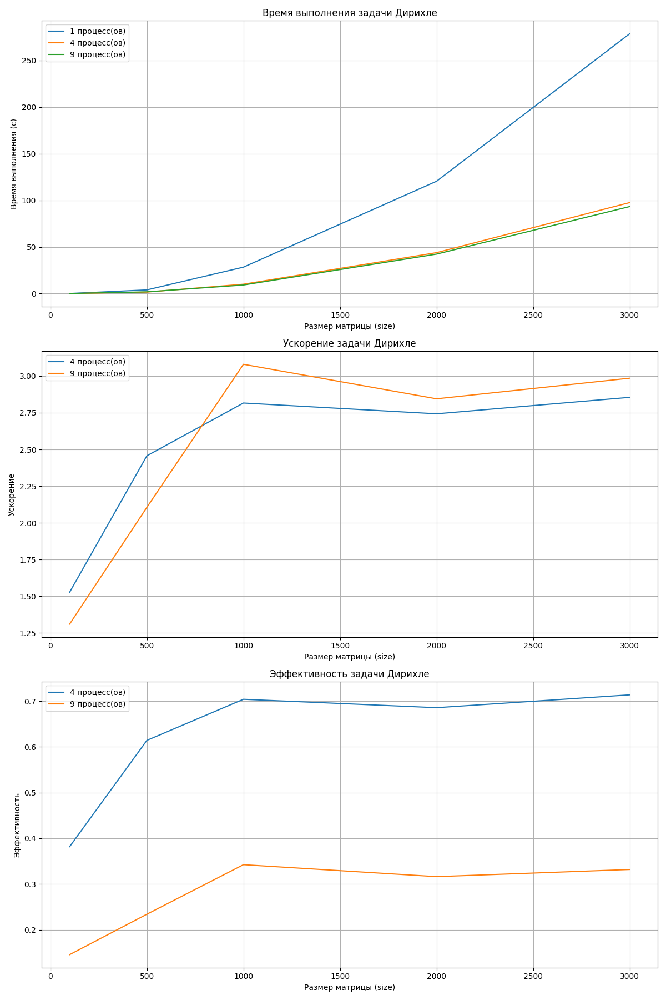

# Lab2 - MPI

| Выполнил   | Стасевич Иван Александрович               |
|------------|-------------------------------------------|
| Группа     | 21ПИ-1                                    |
| Почта      | iastasevich@edu.hse.ru                    |
| ОС         | Windows 11 x64                            |
| RAM        | 16GB                                      |
| CPU        | Intel Core i5-12500H, 12 ядер, 16 потоков |
| Компилятор | GCC-MinGW                                 |

## Условие

См. `task.pdf`

## 1. Умножение матрицы на вектор

**Код:** `src/matvec`

**Результаты:**

**Выводы:**

* Разбиение по блокам с 4 процессами являются наиболее эффективными при обработке больших размеров матриц,
  демонстрируя значительное ускорение.
* Разбиение по блокам с 2 процессами также показывают хороший результат, но менее оптимальны.
* Разбиение по столбцам и строкам алгоритмы менее эффективны при больших размерах матриц и не так хорошо масштабируются.

## 2. Умножение матриц

**Код:** `src/cannon`

**Результаты:**

**Выводы:**

* Увеличение числа процессов приводит к значительному сокращению времени выполнения алгоритма и улучшению
  производительности, особенно на больших размерах матриц.
* Параллелизация более эффективна для больших матриц, что видно из увеличения ускорения с ростом размера матрицы.
* Использование 4 процессов показывает более высокую эффективность и лучшее использование ресурсов по сравнению с 2
  процессами.

## 3. Задача Дирихле

**Код:** `src/dirichlet`

**Результаты:**

**Выводы:**

* Увеличение числа процессов приводит к сокращению времени выполнения задачи Дирихле.
* Ускорение возрастает с ростом размера матрицы, но достигает предела, после которого эффект от увеличения числа
  процессов уменьшается.
* Эффективность также увеличивается с ростом размера матрицы, но при слишком большом числе процессов и размерах матриц
  наблюдается стабилизация или снижение.